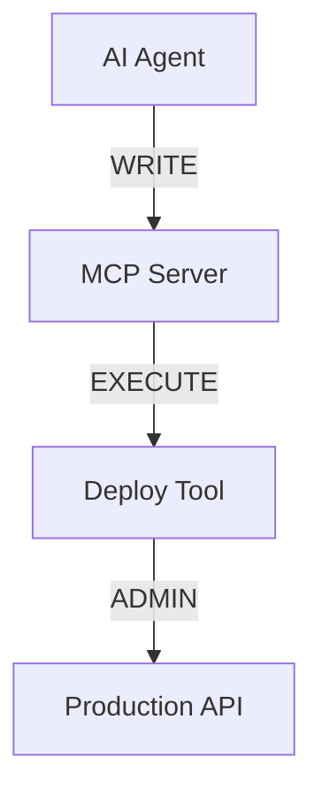

# Raaya 🛡️

**Security reachability scanner for AI agents and Model Context Protocol (MCP) integrations.**

Raaya maps how capabilities flow through your AI agent ecosystem — from **Agents → MCP Servers → Tools → Resources** — and identifies security-surface expansion, excessive permissions, and transitive blast radius.

It is designed to bring security visibility to AI agent infrastructure in the same way traditional security tooling maps dependencies, permissions, and attack surfaces.

---

## Why Raaya?

AI agents increasingly connect to MCP servers, tools, APIs, files, databases, and other runtime resources.

A seemingly harmless change can create an unexpected capability path:

```text
Agent
  │
  ▼
MCP Server
  │
  ▼
Tool
  │
  ▼
Resource
```

For example:

```text
Coding Agent
    │
    ├── READ ──► Repository
    │
    ├── WRITE ─► Repository
    │
    └── EXECUTE ─► Shell Tool
                       │
                       └──► Production Environment
```

Raaya makes these relationships explicit and answers questions such as:

* What can this agent ultimately access?
* Which tools can reach sensitive resources?
* What capabilities propagate transitively?
* What happens if an MCP server or tool is compromised?
* Did a pull request introduce a new security capability?
* Did a change escalate `READ` access to `WRITE` or `EXECUTE`?
* Which downstream resources are exposed by a compromised component?

---

## ✨ Key Features

### 🔍 Hybrid Discovery

Raaya combines multiple discovery techniques to construct a unified security graph.

It can inspect:

* Source code ASTs
* MCP configuration files
* `mcp.json`
* `claude_desktop_config.json`
* Raaya annotations
* Runtime ports and services
* Agent prompt definitions
* MCP server and tool definitions

Example annotation:

```go
// @raaya:capability WRITE
func deployApplication() {
    // ...
}
```

---

### 🕸️ Security Graph

Raaya represents the AI ecosystem as a directed security graph:

```text
┌────────────┐
│   Agent    │
└─────┬──────┘
      │
      ▼
┌────────────┐
│ MCP Server │
└─────┬──────┘
      │
      ▼
┌────────────┐
│    Tool    │
└─────┬──────┘
      │
      ▼
┌────────────┐
│  Resource  │
└────────────┘
```

Each relationship can carry capabilities such as:

* `READ`
* `WRITE`
* `EXECUTE`
* `ADMIN`

The graph becomes the foundation for security analysis, capability propagation, blast-radius calculation, and PR diffing.

---

### 🔗 Transitive Capability Propagation

Capabilities can propagate through multiple graph levels.

For example:

```text
Agent
  │ WRITE
  ▼
MCP Server
  │ EXECUTE
  ▼
Tool
  │ ADMIN
  ▼
Production Resource
```

Raaya evaluates the reachable capability surface rather than looking only at direct permissions.

The propagation engine uses graph traversal to determine downstream exposure.

---

### 💥 Blast Radius Analysis

Raaya can calculate the downstream impact of compromising a graph entity.

Example:

```text
                 ┌──► Database
                 │
Agent ──► MCP ──► Tool ──► File System
                 │
                 └──► Deployment API
```

If the MCP server is compromised, Raaya can identify the resources reachable through its connected tools and capabilities.

This helps answer:

> "If this component is compromised, what could potentially be reached next?"

---

### 🔀 PR Capability Diffing

Raaya compares security graphs across Git revisions.

For example:

```diff
Agent → MCP → Database
             READ
```

becoming:

```diff
Agent → MCP → Database
             READ
             WRITE
```

can be detected as a capability escalation.

Raaya can identify changes such as:

* New Agent → Tool paths
* New MCP servers
* New tools
* New resources
* Permission escalation
* Newly reachable resources
* New `EXECUTE` capabilities
* New `ADMIN` capabilities
* Expanded transitive capability paths

This makes security reachability part of the normal pull-request workflow.

---

## 🧠 Architecture

```text
                    ┌──────────────────────┐
                    │    Source Code       │
                    └──────────┬───────────┘
                               │
                    ┌──────────▼───────────┐
                    │   Discovery Engine   │
                    │                      │
                    │ AST / MCP / Runtime  │
                    │ Annotations / Prompts│
                    └──────────┬───────────┘
                               │
                               ▼
                    ┌──────────────────────┐
                    │    Security Graph    │
                    │                      │
                    │ Agent                │
                    │ MCP Server           │
                    │ Tool                 │
                    │ Resource             │
                    └──────────┬───────────┘
                               │
                 ┌─────────────┼─────────────┐
                 │             │             │
                 ▼             ▼             ▼
          ┌────────────┐ ┌──────────┐ ┌────────────┐
          │ Capability │ │  Blast   │ │   Policy   │
          │ Propagation│ │  Radius  │ │ Evaluation │
          └──────┬─────┘ └────┬─────┘ └─────┬──────┘
                 │             │             │
                 └─────────────┼─────────────┘
                               ▼
                    ┌──────────────────────┐
                    │ Security Analysis    │
                    └──────────┬───────────┘
                               │
             ┌─────────────────┼──────────────────┐
             │                 │                  │
             ▼                 ▼                  ▼
        Terminal          JSON / SARIF       GitHub PR
        Output             Reports           Comments
```

---

## 📂 Project Structure

```text
raaya/
├── cmd/
│   └── raaya/
│       ├── main.go
│       └── subcmds/
│           ├── check.go
│           ├── diff.go
│           ├── doctor.go
│           ├── graph.go
│           └── hook.go
│
├── pkg/
│   ├── analysis/
│   │   ├── delta.go
│   │   ├── engine.go
│   │   ├── rego_engine.go
│   │   ├── fixer/
│   │   ├── policies/
│   │   └── rules/
│   │
│   ├── blastradius/
│   │   ├── calculator.go
│   │   └── propagation.go
│   │
│   ├── config/
│   │   └── config.go
│   │
│   ├── discovery/
│   │   ├── annotation.go
│   │   ├── hybrid.go
│   │   ├── live.go
│   │   ├── mcp.go
│   │   └── prompt.go
│   │
│   ├── graph/
│   │   ├── builder.go
│   │   ├── export.go
│   │   ├── types.go
│   │   └── visualizer.go
│   │
│   └── reporter/
│       ├── comment.go
│       ├── diff_reporter.go
│       ├── json.go
│       ├── sarif.go
│       └── terminal.go
│
├── go.mod
├── go.sum
└── README.md
```

---

## 🚀 Installation

### From source

```bash
git clone https://github.com/<YOUR_ORG>/raaya.git

cd raaya

go build -o raaya ./cmd/raaya
```

Install the binary:

```bash
go install ./cmd/raaya
```

Verify the installation:

```bash
raaya --help
```

> Replace `<YOUR_ORG>` with the GitHub organization or username hosting Raaya.

---

## ⚡ Quick Start

Run a security analysis against the current repository:

```bash
raaya check
```

Generate a security graph:

```bash
raaya graph
```

Export the graph as Mermaid:

```bash
raaya graph --format mermaid
```

Export as Graphviz DOT:

```bash
raaya graph --format dot
```

Check the current Git revision against another revision:

```bash
raaya diff main
```

Run the environment health check:

```bash
raaya doctor
```

Install the Git pre-commit hook:

```bash
raaya hook install
```

---

## 🔎 `raaya check`

The `check` command performs security analysis against the discovered AI ecosystem.

```bash
raaya check
```

Typical workflow:

```text
Source Code
    │
    ▼
Discovery
    │
    ▼
Security Graph
    │
    ▼
Capability Propagation
    │
    ▼
Rules + Rego Policies
    │
    ▼
Findings
```

Example terminal output:

```text
Raaya Security Analysis

✓ Agents discovered:       3
✓ MCP servers discovered:  5
✓ Tools discovered:       17
✓ Resources discovered:   12

Capabilities:
  READ:       21
  WRITE:       8
  EXECUTE:     4
  ADMIN:       1

Findings:
  HIGH    Tool "deploy" reaches production API
  MEDIUM  Agent has WRITE access to repository
  LOW     MCP server exposes unrestricted filesystem path

Result: 3 findings
```

---

## 🔀 `raaya diff`

Analyze security changes between Git revisions:

```bash
raaya diff main
```

Example:

```text
Raaya Capability Diff

Added:
  + Agent → MCP Server → deploy
  + Tool "deploy" → Production API
  + EXECUTE capability

Escalated:
  ~ Repository: READ → WRITE

Removed:
  - None

Security Surface:
  New reachable resources: 2
  New capabilities:       3
  Permission escalations: 1
```

This command is intended for pull-request and CI/CD workflows.

---

## 🗺️ `raaya graph`

Visualize the discovered security topology.

### Mermaid

```bash
raaya graph --format mermaid
```

Example:



### Graphviz

```bash
raaya graph --format dot
```

The generated DOT output can be rendered using Graphviz tooling.

---

## 🩺 `raaya doctor`

Check whether the local environment is ready for Raaya:

```bash
raaya doctor
```

The diagnostic command can validate:

* Go/runtime environment
* Configuration
* MCP configuration discovery
* Repository state
* Runtime connectivity
* Required dependencies
* Policy configuration

---

## 🪝 Git Hooks

Raaya can integrate into the local Git workflow.

Install:

```bash
raaya hook install
```

The hook can run security checks before changes are committed.

This provides an early feedback loop before security-surface changes reach CI.

---

# ⚙️ Discovery

Raaya uses a hybrid discovery pipeline.

```text
                  Discovery Engine
                         │
       ┌─────────────────┼─────────────────┐
       │                 │                 │
       ▼                 ▼                 ▼
   Source AST       MCP Config        Runtime
       │                 │                 │
       ▼                 ▼                 ▼
  Annotations        MCP Tools       Live Ports
       │                 │                 │
       └─────────────────┼─────────────────┘
                         ▼
                  Security Graph
```

## Source Code Discovery

Raaya can inspect source code to identify agent and tool definitions.

The discovery engine is designed to support AST-based analysis rather than relying exclusively on text matching.

---

## MCP Configuration Discovery

Raaya can inspect common MCP configuration formats, including:

```text
mcp.json
claude_desktop_config.json
```

Example configuration:

```json
{
  "mcpServers": {
    "filesystem": {
      "command": "npx",
      "args": ["-y", "@modelcontextprotocol/server-filesystem"]
    }
  }
}
```

Raaya converts discovered MCP relationships into graph entities.

---

## Annotation Discovery

Projects can explicitly declare capabilities using annotations.

Example:

```go
// @raaya:capability READ
func readRepository() {
}
```

Multiple capabilities can be declared:

```go
// @raaya:capability READ WRITE
func modifyRepository() {
}
```

Annotations are useful when capabilities cannot be reliably inferred from source structure alone.

---

## Runtime Discovery

The live discovery engine can inspect configured runtime endpoints and ports to identify active services relevant to the security graph.

Runtime discovery complements static analysis rather than replacing it.

---

# 🔐 Capability Model

Raaya currently models four primary capability levels:

| Capability | Meaning                                     |
| ---------- | ------------------------------------------- |
| `READ`     | Ability to retrieve or inspect information  |
| `WRITE`    | Ability to create or modify information     |
| `EXECUTE`  | Ability to execute an operation or command  |
| `ADMIN`    | Administrative or highly privileged control |

Capabilities are attached to graph relationships and propagated through reachable paths according to the analysis model.

---

# 💥 Blast Radius

Blast-radius analysis evaluates the downstream graph reachable from a compromised entity.

Conceptually:

```text
Compromised Node
      │
      ▼
Reachable Node
      │
      ▼
Reachable Resource
      │
      ▼
Effective Capability
```

For example:

```text
Compromised MCP Server
        │
        ├──► Git Repository       WRITE
        │
        ├──► Database             READ
        │
        └──► Deployment Tool      EXECUTE
                                      │
                                      ▼
                                Production API
```

The blast-radius engine uses graph traversal to calculate downstream exposure.

---

# 📜 Policy Engine

Raaya supports policy evaluation using **OPA/Rego**.

Policies can be used to express organization-specific security requirements.

Example policy concept:

```rego
package raaya.security

deny[msg] {
    input.capability == "ADMIN"
    input.environment == "production"

    msg := "ADMIN capability is not permitted in production"
}
```

Policies allow teams to customize security controls without modifying the core scanner.

---

# 🛠️ Automated Remediation

The analysis package includes a remediation layer for findings that can be safely fixed automatically.

Potential remediation workflows include:

```text
Finding
   │
   ▼
Remediation Candidate
   │
   ▼
Safety Validation
   │
   ▼
Suggested / Automated Fix
```

Automated remediation should be used with appropriate review and repository controls.

---

# 📊 Output Formats

Raaya supports multiple reporting formats.

### Terminal

```bash
raaya check
```

### JSON

```bash
raaya check --format json
```

Useful for:

* CI pipelines
* Custom automation
* Security dashboards
* Programmatic analysis

### SARIF

```bash
raaya check --format sarif
```

SARIF can integrate findings with GitHub's code-scanning ecosystem.

### Markdown

Raaya can generate Markdown summaries suitable for pull-request comments.

---

# 🤖 CI/CD Integration

Raaya is designed to run as part of CI/CD.

A typical workflow:

```text
Pull Request
     │
     ▼
   Raaya
     │
     ├── Discover
     │
     ├── Build Graph
     │
     ├── Propagate Capabilities
     │
     ├── Compare Security Surface
     │
     ├── Evaluate Policies
     │
     └── Report
          │
          ├── GitHub PR Comment
          ├── SARIF
          ├── JSON
          └── CI Exit Code
```

Example GitHub Actions workflow:

```yaml
name: Raaya Security

on:
  pull_request:
  push:
    branches:
      - main

jobs:
  security:
    runs-on: ubuntu-latest

    steps:
      - name: Checkout
        uses: actions/checkout@v4
        with:
          fetch-depth: 0

      - name: Setup Go
        uses: actions/setup-go@v5
        with:
          go-version: "1.24"

      - name: Build Raaya
        run: go build -o raaya ./cmd/raaya

      - name: Run Raaya
        run: ./raaya check

      - name: Check capability diff
        if: github.event_name == 'pull_request'
        run: ./raaya diff "${{ github.event.pull_request.base.sha }}"
```

Adjust the Go version and CLI arguments to match the release configuration of your project.

---

# 🧩 Security Graph Concepts

The graph consists of **nodes**, **edges**, and **capabilities**.

### Nodes

Typical node types include:

```text
Agent
MCP Server
Tool
Resource
```

### Edges

Edges describe relationships:

```text
Agent ──► MCP Server
MCP Server ──► Tool
Tool ──► Resource
```

### Permissions

Edges can carry capabilities:

```text
READ
WRITE
EXECUTE
ADMIN
```

This produces a graph such as:

```text
Agent
 │
 │ READ
 ▼
MCP Server
 │
 │ EXECUTE
 ▼
Tool
 │
 │ WRITE
 ▼
Resource
```

---

# 🧪 Development

Clone the repository:

```bash
git clone https://github.com/<YOUR_ORG>/raaya.git
cd raaya
```

Run tests:

```bash
go test ./...
```

Run static checks:

```bash
go vet ./...
```

Build:

```bash
go build ./...
```

Run Raaya directly:

```bash
go run ./cmd/raaya check
```

---

# 🧱 Design Principles

Raaya is built around several principles:

### Security as a Graph

Security relationships are often transitive. Raaya models them as a graph rather than treating every permission independently.

### Least Privilege Visibility

The scanner focuses on understanding what capabilities are available and where they can propagate.

### Security-Surface Changes

A pull request can introduce security impact even when the application code appears functionally unrelated to security.

Raaya therefore treats changes in reachable capabilities as first-class security changes.

### Static + Runtime Context

Static analysis provides repository-level visibility while runtime discovery provides additional environmental context.

### Policy as Code

Organizations can encode security requirements using Rego rather than hard-coding every rule into the scanner.

### CI-Native

Security analysis should be available during development and pull requests, not only after deployment.

---

# 🗺️ Roadmap

Potential future capabilities include:

* [ ] Expanded MCP protocol discovery
* [ ] Additional agent framework integrations
* [ ] More runtime discovery providers
* [ ] Enhanced capability inference
* [ ] Advanced attack-path analysis
* [ ] Interactive security graph UI
* [ ] Security graph persistence
* [ ] Historical capability tracking
* [ ] Organization-wide policy management
* [ ] Additional CI/CD integrations
* [ ] IDE/editor integrations
* [ ] Additional remediation workflows

---

# 🤝 Contributing

Contributions are welcome.

A typical contribution workflow:

```bash
git checkout -b feature/my-change

go test ./...

git commit -m "feat: describe my change"

git push origin feature/my-change
```

Then open a pull request.

When contributing security-sensitive functionality, please include:

* Tests
* Security considerations
* Example graph changes where applicable
* Policy changes if relevant
* Documentation updates

---

# 🔒 Security

If you discover a security vulnerability in Raaya, please avoid opening a public issue with sensitive details.

Instead, follow the security disclosure process defined by the repository maintainers.

---

# 📄 License


```text
MIT License
```

See [`LICENSE`](LICENSE) for details.

---

# ⭐ Raaya

**Map your AI agent's capabilities before they become your attack surface.**

Raaya brings security reachability analysis to AI agents, MCP servers, tools, and resources — giving engineering and security teams visibility into how capabilities propagate across modern AI application architectures.
